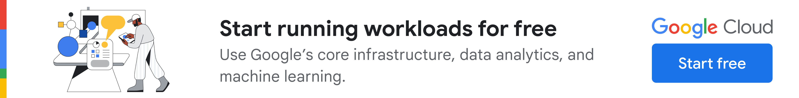
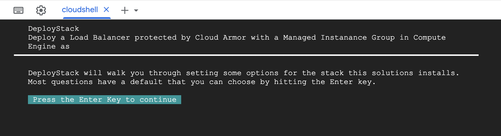

[](https://cloud.google.com/?utm_source=github&utm_medium=referral&utm_campaign=GCP&utm_content=packages_repository_banner)
# Protect your High Availability workloads with Load Balancer and Cloud Armor

## Introduction

_This architecture uses click-to-deploy so you can spin up infrastructure in minutes using terraform!_

DDoS attacks are a type of cyber attack that can overwhelm a website or server with traffic, making it unavailable to users. These attacks can incur significant costs and disruptions, severely affecting your business.**Cloud Armor** is a robust solution that shields your applications from an extensive array of attacks, including **SQL injection**, **cross-site scripting (XXS)** and **Denial of Service.** 

**Cloud load balancing** is a service that distributes incoming network or application traffic across multiple servers. This can help to improve the performance, reliability, and availability of your applications. **When you combine Cloud Armor and Load Balancing**, you can create a **powerfu**l and **scalable security solution **for your applications.** Cloud Armor** can **protect your applications** from a wide range of attacks, while **Load Balancing** can ensure your apps are **always available**.


This repo is based on the Cloud Foundation Fabric blueprint available [here](https://github.com/GoogleCloudPlatform/cloud-foundation-fabric/tree/master/blueprints/networking/glb-and-armor).

## Use cases

Various implementation methods exist for architectures. Certain workloads demand high compute power or specific licenses, necessitating secure, managed services available across multiple regions. This architecture involves Managed Instance Groups in multiple regions accessible via an HTTP Load Balancer with Cloud Armor enabled, making it ideal for these use cases.

This architecture caters to multiple workloads ranging from the ones requiring compliance with specific data access restrictions to compute-specific proprietary applications with specific licensing and OS requirements. Descriptions of some possible use-cases are as follows:

* __Proprietary OS workloads__: Some applications require specific Operating systems (enterprise grade Linux distributions for example) with specific licensing requirements or low-level access to the kernel. For such applications that cannot be containerized and require horizontal scaling, the ideal solution is a multi-region Managed Instance Group (MIG) with custom instance images.
* __Industry-specific applications__: Other applications may require high compute power alongside a sophisticated layer of networking security. This architecture meets these requirements by providing configurable compute power on instances supported by Cloud Armor features like traffic restriction and DDoS protection.
* __Workloads requiring GDPR compliance__: Many applications need to restrict data access and usage to comply with specific data residency requirements, usually limited to a certain region. This architecture caters to such workloads as Cloud Armor allows you to lock access to your workloads from various fine-grained identifiers.
* __Medical Queuing systems__: Another great example usage for this  architecture will be applications requiring high compute power, availability and limited memory access requirements such as a medical queuing system.
* __DDoS Protection and WAF__:  Applications and workloads exposed to the internet expose themselves to the risk of DDoS attacks. While L3/L4 and protocol based attacks are handled at Google’s edge, L7 attacks can still be effective with botnets. A setup of an external Cloud Load Balancer with Cloud Armor and appropriate WAF rules can mitigate such attacks.
* __Geofencing__: If you want to restrict content served on your application due to licensing restrictions (similar to OTT content in the US), Geofencing allows you to create a virtual perimeter to stop the service from being accessed outside the region. The architecture of using a Cloud Load Balancer with Cloud Armor enables you to implement geofencing around your applications and services.

## Architecture

<p align="center">  </p>

The main components that we would be setting up are (to learn more about these products, click on the hyperlinks):

* [Cloud Armor](https://cloud.google.com/armor) - Google Cloud Armor is the web-application firewall (WAF) and DDoS mitigation service that helps users defend their web apps and services at Google scale at the edge of Google’s network.
* [Cloud Load Balancer](https://cloud.google.com/load-balancing) - When your app usage spikes, it is important to scale, optimize and secure the app. Cloud Load Balancing is a fully distributed solution that balances user traffic to multiple backends to avoid congestion, reduce latency and increase security. Some important features it offers that we use here are:
  * Single global anycast IP and autoscaling - CLB acts as a frontend to all your backend instances across all regions. It provides cross-region load balancing, automatic multi-region failover and scales to support increase in resources.
  * Global Forwarding Rule - To route traffic to different regions, global load balancers use global forwarding rules, which bind the global IP address and a single target proxy.
  * Target Proxy - For external HTTP(S) load balancers, proxies route incoming requests to a URL map. This is essentially how you can handle the connections.
  * URL Map - URL Maps are used to route requests to a backend service based on the rules that you define for the host and path of an incoming URL.
  * Backend Service - A Backend Service defines CLB distributes traffic. The backend service configuration consists of a set of values - protocols to connect to backends, session settings, health checks and timeouts.
  * Health Check - Health check is a method provided to determine if the corresponding backends respond to traffic. Health checks connect to backends on a configurable, periodic basis. Each connection attempt is called a probe. Google Cloud records the success or failure of each probe.
* [Firewall Rules](https://cloud.google.com/vpc/docs/firewalls) - Firewall rules let you allow or deny connections to or from your VM instances based on a configuration you specify.
* [Managed Instance Groups (MIG)](https://cloud.google.com/compute/docs/instance-groups) - Instance group is a collection of VM instances that you can manage as a single entity. MIGs allow you to operate apps and workloads on multiple identical VMs. You can also leverage the various features like autoscaling, autohealing, regional / multi-zone deployments.

## Costs

Pricing Estimates - We have created a sample estimate based on some usage we see from new startups looking to scale. This estimate would give you an idea of how much this deployment would essentially cost per month at this scale and you extend it to the scale you further prefer. Here's the [link](https://cloud.google.com/products/calculator/#id=3105bbf2-4ee0-4289-978e-9ab6855d37ed).

## Setup

This solution assumes you already have a project created and set up where you wish to host these resources. If not, and you prefer the system to create a new project for you,  please refer to the [github repository](https://github.com/GoogleCloudPlatform/cloud-foundation-fabric/tree/master/blueprints/data-solutions/gcs-to-bq-with-least-privileges) for instructions.

### Prerequisites

* Have an [organization](https://cloud.google.com/resource-manager/docs/creating-managing-organization) set up in Google cloud.
* Have a [billing account](https://cloud.google.com/billing/docs/how-to/manage-billing-account) set up.
* Have an existing [project](https://cloud.google.com/resource-manager/docs/creating-managing-projects) with [billing enabled](https://cloud.google.com/billing/docs/how-to/modify-project).

### Roles & Permissions

In order to spin up this architecture, you will need to be a user with the “__Project owner__” [IAM](https://cloud.google.com/iam) role on the existing project:

Note: To assign a role to a user, consult the [Granting and Revoking Access](https://cloud.google.com/iam/docs/granting-changing-revoking-access#grant-single-role) documentation.

### Spinning up the architecture

Before we deploy the architecture, you will need the following information:

* The __project ID__

Click the button below, sign in if necessary, and confirm when prompted. The system will guide you through setting up your architecture.

[](https://shell.cloud.google.com/cloudshell/editor?cloudshell_git_repo=https://github.com/GoogleCloudPlatform/deploystack-google-lb-and-armor&cloudshell_image=gcr.io%2Fds-artifacts-cloudshell%2Fdeploystack_custom_image&cloudshell_git_branch=main&cloudshell_tutorial=tutorial.md)

This is the startup screen that appears after clicking the button and confirming:



During the process, you will be asked for some user input. All necessary variables are explained at the bottom of this ReadMe file. In case of failure, you can simply click the button again.

<center>
<h4>🎉 Congratulations! 🎉  <br />
You have successfully deployed an HTTP Load Balancer with two Managed Instance Group backends and Cloud Armor security.</h4></center>

## Testing your architecture

1. Connect to the siege VM using SSH (from Cloud Console or CLI) and run the following command:

        siege -c 250 -t150s http://$LB_IP

2. In the Cloud Console, on the Navigation menu, click __Network Services > Load balancing__.
3. Click __Backends__, then click __http-backend__ and navigate to __http-lb__
4. Click on the __Monitoring__ tab.
5. Monitor the Frontend Location (Total inbound traffic) between North America and the two backends for 2 to 3 minutes. At first, traffic should just be directed to __us-east1-mig__ but as the RPS increases, traffic is also directed to __europe-west1-mig__. This demonstrates that by default traffic is forwarded to the closest backend but if the load is very high, traffic can be distributed across the backends.
6. Now, to test the IP deny-listing, run terraform as follows:

        terraform apply -var project_id=my-project-id -var enforce_security_policy=true

This applies a security policy to denylist the IP address of the siege VM.

7. To test this, run the following command from the siege VM and verify that you get a __403 Forbidden__ error code back.

        curl http://$LB_IP

## Cleaning up your environment

The easiest way to remove all the deployed resources is to run the following command in Cloud Shell:

``` {shell}
deploystack uninstall
```

The above command will delete the associated resources so there will be no billable charges made afterwards.

<!-- BEGIN TFDOC -->

## Variables

| name | description | type | required | default |
|---|---|:---:|:---:|:---:|
| [project_id](variables.tf#L26) | Identifier of the project. | <code>string</code> | ✓ |  |
| [enforce_security_policy](variables.tf#L31) | Enforce security policy. | <code>bool</code> |  | <code>true</code> |
| [prefix](variables.tf#L37) | Prefix used for created resources. | <code>string</code> |  | <code>null</code> |
| [project_create](variables.tf#L17) | Parameters for the creation of the new project. | <code title="object&#40;&#123;&#10;  billing_account_id &#61; string&#10;  parent             &#61; string&#10;&#125;&#41;">object&#40;&#123;&#8230;&#125;&#41;</code> |  | <code>null</code> |

## Outputs

| name | description | sensitive |
|---|---|:---:|
| [glb_ip_address](outputs.tf#L18) | Load balancer IP address. |  |
| [vm_siege_external_ip](outputs.tf#L23) | Siege VM external IP address. |  |

<!-- END TFDOC -->
